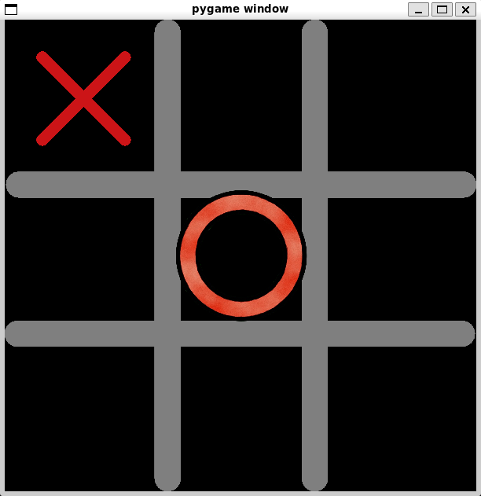

# NEAT AI Tic Tac Toe

This project is a Tic Tac Toe game powered by a neural network trained using the NEAT (NeuroEvolution of Augmenting Topologies) algorithm. The AI can be trained from scratch or used directly with a pre-trained model.

## Features
- Trainable AI using NEAT
- Pre-trained AI included for immediate play
- Simple GUI using Pygame
- Run and play easily via a shell script

## Setup
The packages you need are in the requirements.txt
```bash
python -m venv venv
pip install -r requirements.txt
```

## How to Use
### 1. Run the App
```bash
./run.sh
```
This will launch the GUI where you can choose to play against the AI or train your own AI.

### 2. Train the AI
If you want to train the AI yourself using NEAT, the run_neat function is used.

### Play Against AI
To play against the pre-trained AI, use play_with_ai function.

## Notes
- If you'd like to tweak training parameters, edit the NEAT config file accordingly.

- Make sure the .pickle file is in the correct location if you’re using your own trained AI.

## Screenshot

